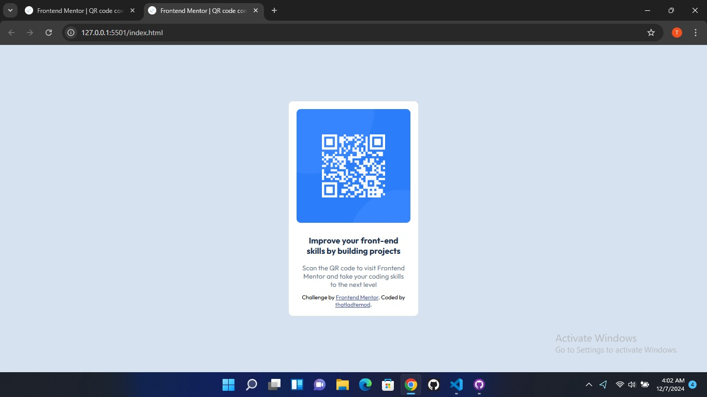

## Frontend Mentor - QR code component solution

This is the solution to the [QR code component challenge on Frontend Mentor](https://thatladtemod.github.io). Frontend Mentor challenges help you improve your coding skills by building realistic projects.

## Table of contents

- [Overview](#overview)
    - [Screenshot](#screenshot)
    - [links](#links)

- [My process](#my-process)
    - [Built with](#built-with)
    - [What I learned](#what-i-learned)
    - [Continued development](#continued-development)
    - [Useful resources](#useful-resources)

- [Author](#author)
- [Acknowledgments](#acknowledgements)

## Overview

### Screenshot



### Links

- Solution URL: [This is the solution URL](https://github.com/thatladtemod/thatladtemod.github.io.git)
- Live Site URL: [This is the live site URL](https://thatladtemod.github.io)

## My process

### Built with

- Semantic HTML5 markup
- CSS custom properties
- Flexbox

### What I learned 

When I was styling the QR code I got stuck because the container div was not centering on both axes of the web page. So, here's what i learned;

```css
.container {
        display: flex;
        height: 100vh;
        background: hsl(212, 45%, 89%);
        justify-content: center;
        align-items: center;
      }
```

This is how to center a div.

### Continued development

I would like to continue developing my skills in CSS and understanding the layouts.

### Useful resources

- [freeCodeCamp](https://www.freecodecamp.org/)

freeCodeCamp helped me with the basics of HTML and CSS.

## Author

- Frontend Mentor - [@thatladtemod](https://www.frontendmentor.io/profile/thatladtemod)

- Twitter - [@TemitayoDamilo2](https://x.com/TemitayoDamilo2)

## Acknowledgments


When I was stuck at the div-centering part of the project, I posted the problem on X (formerly twitter) and on a few Whatsapp groups, the senior developers helped me out. I am really grateful, thank you.